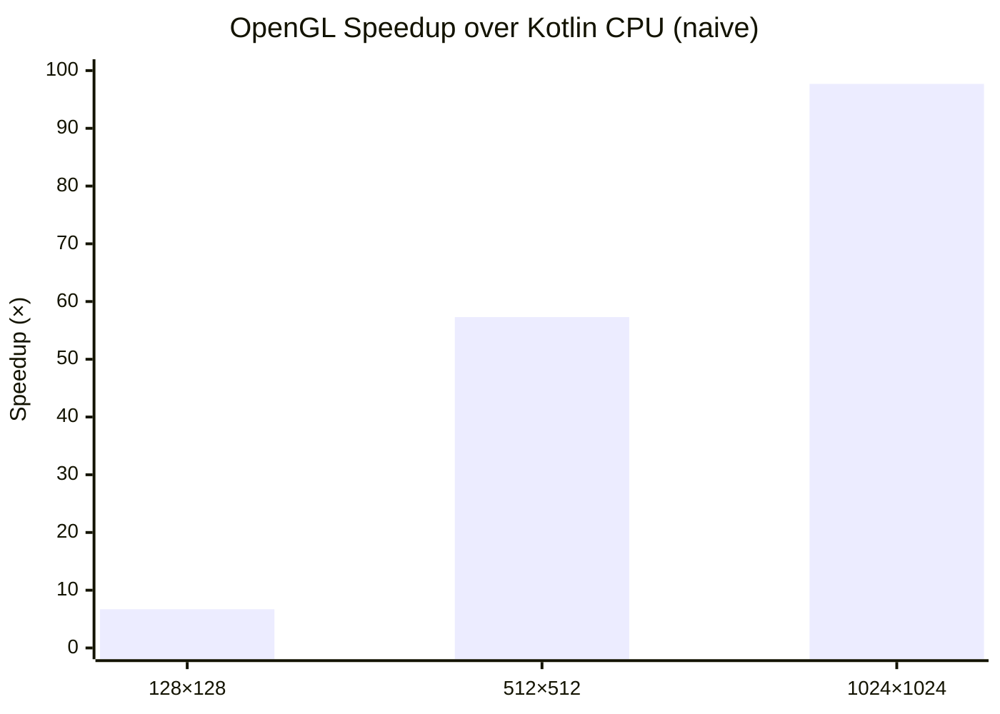

# Kompute: GPU Compute Shaders for Kotlin

Kompute is a Kotlin library designed to simplify the integration of GPU compute shaders into Kotlin applications. It
provides a high-level API for managing GPU resources, executing compute operations, and handling data transfers between
the CPU and GPU. With Kompute, developers can leverage the power of GPU acceleration for computationally intensive
tasks, such as machine learning inference, physics simulations, and data processing.

## CI Status

|                                                                               Build                                                                               |                  Core Coverage                   |                   OpenGL Coverage                    |                                     Last Commit                                      |                                Open Issues                                 |                                    Repo Size                                     |
|:-----------------------------------------------------------------------------------------------------------------------------------------------------------------:|:------------------------------------------------:|:----------------------------------------------------:|:------------------------------------------------------------------------------------:|:--------------------------------------------------------------------------:|:--------------------------------------------------------------------------------:|
| [](https://github.com/klaushauschild1984/kompute/actions/workflows/ci.yml) |  |  |  |  |  |

## Requirements

| Requirement | Version                                                                                  |
|-------------|------------------------------------------------------------------------------------------|
| JDK         |                                       |
| Kotlin      |  |
| OpenGL      |                                  |
| OS          |                    |


## Getting Started

| JitPack                                                                                                           | License                                                                         |
|-------------------------------------------------------------------------------------------------------------------|---------------------------------------------------------------------------------|
| [](https://jitpack.io/#klaushauschild1984/kompute) | [](LICENSE) |

Add the JitPack repository and the dependency to your build.

> **Note:** LWJGL native bindings are not included transitively — add the ones matching your target platform.

### Gradle (Kotlin DSL)

```kotlin
repositories {
    maven("https://jitpack.io")
}

dependencies {
    implementation("com.github.klaushauschild1984.kompute:kompute-opengl:v0.7.0")

    implementation(platform("org.lwjgl:lwjgl-bom:3.3.4"))
    runtimeOnly("org.lwjgl:lwjgl::natives-linux")
    runtimeOnly("org.lwjgl:lwjgl-glfw::natives-linux")
    runtimeOnly("org.lwjgl:lwjgl-opengl::natives-linux")
}
```

### Maven

```xml
<repositories>
    <repository>
        <id>jitpack.io</id>
        <url>https://jitpack.io</url>
    </repository>
</repositories>

<dependencyManagement>
    <dependencies>
        <dependency>
            <groupId>org.lwjgl</groupId>
            <artifactId>lwjgl-bom</artifactId>
            <version>3.3.4</version>
            <type>pom</type>
            <scope>import</scope>
        </dependency>
    </dependencies>
</dependencyManagement>

<dependencies>
    <dependency>
        <groupId>com.github.klaushauschild1984.kompute</groupId>
        <artifactId>kompute-opengl</artifactId>
        <version>v0.7.0</version>
    </dependency>
    <dependency>
        <groupId>org.lwjgl</groupId>
        <artifactId>lwjgl</artifactId>
        <classifier>natives-linux</classifier>
        <scope>runtime</scope>
    </dependency>
    <dependency>
        <groupId>org.lwjgl</groupId>
        <artifactId>lwjgl-glfw</artifactId>
        <classifier>natives-linux</classifier>
        <scope>runtime</scope>
    </dependency>
    <dependency>
        <groupId>org.lwjgl</groupId>
        <artifactId>lwjgl-opengl</artifactId>
        <classifier>natives-linux</classifier>
        <scope>runtime</scope>
    </dependency>
</dependencies>
```

## Usage

Select a backend, attach a compute shader, configure storage buffers, dispatch, and read results.

### Kotlin

```kotlin
Kompute.openGL().use { openGL ->
    val output = StorageBuffer<FloatArray>(1).size(128).asOutput()
    val result = openGL
        .shader(ShaderSource.Code(glslCode))
        .compile()
        .use { it.dispatch(64, StorageBuffer<FloatArray>(0).data(input), output) }
    println(result[output].contentToString())
}
```

Compile once, dispatch many times:

```kotlin
Kompute.openGL().use { openGL ->
    val output = StorageBuffer<FloatArray>(1).size(128).asOutput()
    openGL.shader(ShaderSource.Code(glslCode)).compile().use { shader ->
        repeat(10) { i ->
            val result = shader.dispatch(64, StorageBuffer<FloatArray>(0).data(inputs[i]), output)
            println(result[output].contentToString())
        }
    }
}
```

### Java

```java
try (Backend backend = Kompute.openGL();
     var shader = backend.shader(new ShaderSource.Code(glslCode)).compile()) {
    var output = StorageBuffer.newStorageBuffer(1, float[].class).size(128).asOutput();
    var result = shader.dispatch(64,
        StorageBuffer.newStorageBuffer(0, float[].class).data(input),
        output
    );
    float[] data = result.get(output);
}
```

## Shader Sources

Shaders can be loaded from different sources:

```kotlin
// Inline GLSL
ShaderSource.Code("...")

// File on disk
ShaderSource.File(Path.of("shaders/multiply.glsl"))

// Classpath resource
ShaderSource.Stream(MyClass::class.java.getResourceAsStream("shader.glsl")!!)
```

## Storage Buffer

Storage buffers are the primary data exchange mechanism between CPU and GPU. They can be used
as input, output, or read-write and are bound via `layout(std430, binding = N)` in the shader.

| Kotlin        | GLSL                               |
|---------------|------------------------------------|
| `FloatArray`  | `float` / `vec*` / `mat*`          |
| `IntArray`    | `int` / `ivec*` / `uint` / `uvec*` |
| `DoubleArray` | `double` / `dvec*`                 |
| `ByteArray`   | struct (manual layout)             |

```kotlin
val input  = StorageBuffer<FloatArray>(0).data(floatArrayOf(1f, 2f, 3f))  // input
val output = StorageBuffer<FloatArray>(1).size(128).asOutput()             // output
val inout  = StorageBuffer<FloatArray>(2).data(existing).asOutput()        // read-write
```

## Uniform Buffer Object

UBOs pass read-only configuration data from CPU to shader — ideal for parameters like viewport
dimensions, zoom levels, or transformation matrices. Unlike storage buffers, the shader cannot write UBOs.
They are bound via `layout(std140, binding = N)` in the shader.

| Kotlin      | GLSL                          |
|-------------|-------------------------------|
| `ByteArray` | struct (std140 memory layout) |

Shader:
```glsl
layout(std140, binding = 0) uniform Params {
   vec3  center;   // 12 bytes — but std140 pads vec3 to 16 bytes
   float zoom;     // starts at offset 16, not 12
};
```

Kotlin:
```kotlin
val data = ByteBuffer.allocate(Float.SIZE_BYTES * 4 + Float.SIZE_BYTES)
    .order(ByteOrder.nativeOrder())
    .putFloat(centerX)
    .putFloat(centerY)
    .putFloat(centerZ)
    .putFloat(0f)       // padding — vec3 occupies 16 bytes in std140
    .putFloat(zoom)
    .array()
UniformBufferObject(0).data(data)
```

> **Note:** UBOs use std140 memory layout. `vec3` is aligned to 16 bytes, which requires manual
> padding in the data array. A typed builder to handle alignment automatically is planned for v0.7.0.

## Named Uniform

Named uniforms pass typed values by name directly to the shader — no binding index required.
Unlike UBOs, they are declared as plain `uniform` variables in the shader source.

### Scalars

Shader:
```glsl
uniform float zoom;
uniform int maxIterations;
uniform bool highQuality;
uniform uint flags;
```

Kotlin:
```kotlin
NamedUniform<Float>("zoom").value(1.5f)
NamedUniform<Int>("maxIterations").value(256)
NamedUniform<Boolean>("highQuality").value(true)
NamedUniform<Int>("flags").value(0xFF).asUnsigned()
```

| Kotlin                 | GLSL      |
|------------------------|-----------|
| `Int`                  | `int`     |
| `Int` + `asUnsigned()` | `uint`    |
| `Float`                | `float`   |
| `Double`               | `double`  |
| `Boolean`              | `bool`    |

### Vectors

Shader:
```glsl
uniform vec3 center;
uniform ivec2 offset;
uniform dvec4 color;
```

Kotlin:
```kotlin
NamedUniform<FloatArray>("center").value(floatArrayOf(0f, 0f, 1f))
NamedUniform<IntArray>("offset").value(intArrayOf(10, 20))
NamedUniform<DoubleArray>("color").value(doubleArrayOf(1.0, 0.5, 0.0, 1.0))
```

| Kotlin                                 | GLSL                        |
|----------------------------------------|-----------------------------|
| `FloatArray` (size 2–4)                | `vec2` / `vec3` / `vec4`    |
| `IntArray` (size 2–4)                  | `ivec2` / `ivec3` / `ivec4` |
| `IntArray` + `asUnsigned()` (size 2–4) | `uvec2` / `uvec3` / `uvec4` |
| `DoubleArray` (size 2–4)               | `dvec2` / `dvec3` / `dvec4` |

### Matrices

Shader:
```glsl
uniform mat4 transform;
uniform mat3x2 projection;
uniform dmat3 rotation;
```

Kotlin:
```kotlin
NamedUniform<FloatArray>("transform").value(floatArrayOf(...)).asMatrix(4, 4)
NamedUniform<FloatArray>("projection").value(floatArrayOf(...)).asMatrix(3, 2)
NamedUniform<DoubleArray>("rotation").value(doubleArrayOf(...)).asMatrix(3, 3)
```

| Kotlin                                 | GLSL                        |
|----------------------------------------|-----------------------------|
| `FloatArray` + `asMatrix(N, N)`        | `mat2` / `mat3` / `mat4`    |
| `FloatArray` + `asMatrix(rows, cols)`  | `mat{cols}x{rows}`          |
| `DoubleArray` + `asMatrix(N, N)`       | `dmat2` / `dmat3` / `dmat4` |
| `DoubleArray` + `asMatrix(rows, cols)` | `dmat{cols}x{rows}`         |

> **Note:** Matrices are stored in column-major order, matching OpenGL's default convention.

## Atomic Counter

Atomic counters allow threads to increment a shared counter safely across parallel invocations —
useful for algorithms like Monte-Carlo sampling where multiple threads accumulate a result.
They are declared in GLSL with `layout(binding = N) uniform atomic_uint` and always operate in
read-write mode: an initial value is uploaded before dispatch and the result is read back afterwards.

Shader:
```glsl
layout(binding = 0) uniform atomic_uint hits;
```

Kotlin:
```kotlin
val counter = AtomicCounter(0)           // starts at 0
val counter = AtomicCounter(0).start(42) // starts at 42
```

## Image2D

`image2D` allows compute shaders to write directly to a 2D texture — enabling GPU-side image
generation without transferring intermediate data back to the CPU. The shader writes pixel data
via `imageStore`; after dispatch the raw bytes are read back as an `Image2DResult`.

Shader:
```glsl
layout(binding = 0, rgba8) uniform writeonly image2D outputImage;

void main() {
    ivec2 pos = ivec2(gl_GlobalInvocationID.xy);
    imageStore(outputImage, pos, vec4(1.0, 0.0, 0.0, 1.0)); // red pixel
}
```

Kotlin:
```kotlin
val image = Image2D(0).dimension(1024, 768)                            // RGBA8 by default
val image = Image2D(0).dimension(1024, 768).format(Image2D.Format.R8)  // grayscale
```

The result always contains the raw pixel bytes. For supported formats it can be converted
to a `BufferedImage`:

```kotlin
val result: Image2DResult = result[image]
val bytes: ByteArray      = result.data                  // raw bytes, always available
val img: BufferedImage?   = result.toBufferedImage()     // null if format is not supported
```

### Formats

| Format            | GLSL qualifier | Bytes/pixel | `toBufferedImage()` |
|-------------------|----------------|-------------|---------------------|
| `RGBA8` (default) | `rgba8`        | 4           | `TYPE_INT_ARGB`     |
| `R8`              | `r8`           | 1           | `TYPE_BYTE_GRAY`    |

The GLSL format qualifier in the `layout` declaration must match the Kotlin `Format`.

## Reading Results

After `dispatch()`, results are retrieved by passing the output object as a key:

```kotlin
val data: FloatArray       = result[output]    // StorageBuffer
val count: Int             = result[counter]   // AtomicCounter
val image: Image2DResult   = result[image2D]   // Image2D
```

## Limitations

| Limitation                      | Details                                                                                                                                                                                                   |
|---------------------------------|-----------------------------------------------------------------------------------------------------------------------------------------------------------------------------------------------------------|
| **macOS**                       | OpenGL support on macOS is limited to 4.1 — compute shaders require 4.3 and are therefore not supported. macOS support depends on the upcoming Vulkan backend.                                            |
| **`Image2D.toBufferedImage()`** | Depends on `java.awt` (`java.desktop` module). Not available on minimal JRE distributions built with `jlink` without that module. The raw `Image2DResult.data` bytes are always accessible as a fallback. |

## Performance

Benchmarks are implemented using [JMH](https://github.com/openjdk/jmh) in the `kompute-benchmark` module.
Each benchmark compares a naive Kotlin CPU implementation against the OpenGL compute shader backend.
Backend initialization and shader compilation are excluded from the measurement — only buffer transfer,
dispatch, and readback are measured.

### Matrix multiplication

Matrix multiplication computes `C = A × B` for two square float matrices.
The OpenGL shader launches one thread per output element in a 2D workgroup grid
(`local_size_x = 8, local_size_y = 8`).

Two CPU baselines are compared:

- **Naive** — plain O(n³) triple loop, no parallelism
- **Optimized** — parallelized with Kotlin coroutines *(planned)*

> The naive baseline shows the raw GPU advantage out-of-the-box. The optimized baseline
> will show what CPU-side parallelism can recover — and where GPU processing still wins.

| Size of matrix | Kotlin naive (ms) | Kotlin optimized (ms) | OpenGL (ms) | GPU vs. naive | GPU vs. optimized |
|----------------|-------------------|-----------------------|-------------|---------------|-------------------|
| 128×128        | 1,404             | —                     | 0,208       | ~6,7×         | —                 |
| 512×512        | 124,424           | —                     | 2,172       | ~57×          | —                 |
| 1024×1024      | 2735,201          | —                     | 27,989      | ~97×          | —                 |



## Building

```bash
./gradlew build
```

Tests require a display server and OpenGL-capable GPU. On headless systems use:

```bash
xvfb-run ./gradlew build
```

## Showcase

Ready-to-run examples in the `kompute-showcase` module that demonstrate Kompute's API
against real compute problems.

### Monte Carlo π Approximation

Each GPU thread generates a random point (x, y) in the unit square [0, 1] × [0, 1] and
checks whether it falls inside the unit circle (x² + y² ≤ 1). The ratio of hits to total
samples converges to π/4 — so π ≈ 4 × hits / samples. An [AtomicCounter] counts the hits
safely across thousands of parallel threads.

```kotlin
MonteCarloPiApproximation(samples = 1_000_000).use { monteCarlo ->
  val pi = monteCarlo.approximate()
  println("π ≈ $pi")
}
```

Shader (GLSL):
```glsl
layout(local_size_x = 64) in;
layout(binding = 0) uniform atomic_uint hits;

void main() {
  uint id = gl_GlobalInvocationID.x;
  float x = float(pcg(id))                / float(0xFFFFFFFFu);
  float y = float(pcg(id + 0x9e3779b9u)) / float(0xFFFFFFFFu);
  if (x * x + y * y <= 1.0) {
      atomicCounterIncrement(hits);
  }
}
```

The GPU advantage is visible in parallelism, not precision — Monte Carlo converges with
O(1/√N), delivering roughly one additional correct decimal place per 100× more samples.
The same algorithm on a single CPU thread runs sequentially; the GPU evaluates all samples
in parallel.

## Roadmap

| Version  | Focus                                                                                                                         |
|----------|-------------------------------------------------------------------------------------------------------------------------------|
| `v0.7.0` | Multi-dispatch — `ShaderBuilder.compile()` returns a `CompiledShader` that can be dispatched repeatedly without recompilation |
| `v0.8.0` | Typed builder — `kompute-serialization` with `@GpuStruct` / `@GpuField` and automatic std140/std430 alignment                 |
| `v0.9.0` | Windows support                                                                                                               |
| `v1.0.0` | Vulkan backend                                                                                                                |

The full version history is documented in [CHANGELOG.md](CHANGELOG.md).

## Contributing

Contributions are welcome. Please open an issue first to discuss what you would like to change.
