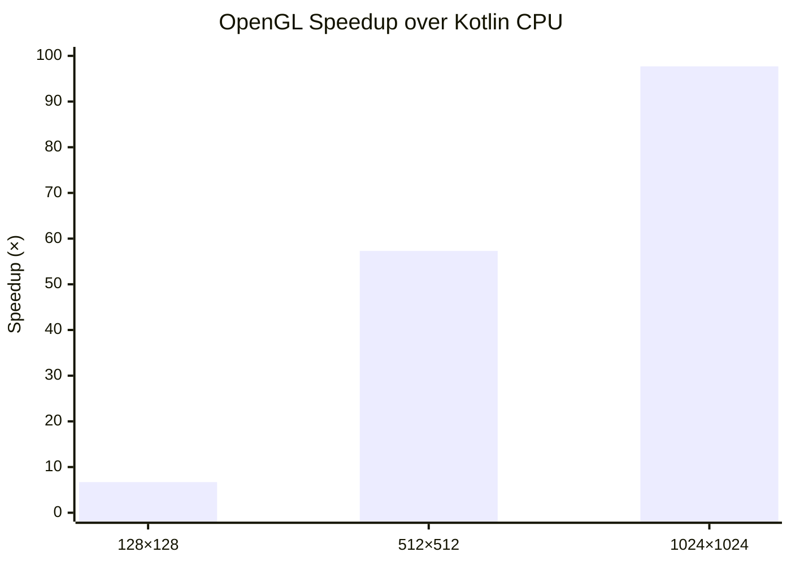

# Kompute: GPU Compute Shaders for Kotlin

Kompute is a Kotlin library designed to simplify the integration of GPU compute shaders into Kotlin applications. It
provides a high-level API for managing GPU resources, executing compute operations, and handling data transfers between
the CPU and GPU. With Kompute, developers can leverage the power of GPU acceleration for computationally intensive
tasks, such as machine learning inference, physics simulations, and data processing.

[](https://github.com/klaushauschild1984/kompute/actions/workflows/ci.yml)


## Usage

```kotlin
Kompute.openGL().use { openGL ->
    val result = openGL
        .shader(ShaderSource.Code(glslCode))
        .data(
            StorageBuffer(0).data(input),
            StorageBuffer(1).size(128).asOutput("result"),
        )
        .dispatch(x = 64)
        .execute()
    println(result.storageBuffer("result").contentToString())
}
```

## Benchmarks

### Matrix multiplication

| Size of matrix | Kotlin (ms) | OpenGL (ms) | Speedup |
|----------------|-------------|-------------|---------|
| 128×128        | 1,404       | 0,208       | ~6,7×   |
| 512×512        | 124,424     | 2,172       | ~57×    |
| 1024×1024      | 2735,201    | 27,989      | ~97×    |



## TODOs

A collection of topics I want to address in the future enhancing the library.

* [ ] API
  * [ ] specific exception handling
  * [ ] generalize buffer setup
    * [x] API overhaul
    * [ ] UBO support
    * [ ] scalar uniform support
    * [ ] atomic counter support
    * [ ] image2D support
  * [ ] binding validation (collisions, shader inspection)
* [ ] OpenGL
  * [ ] optimization
    * [ ] shader caching
    * [ ] pre-compilation
    * [ ] multi-dispatch
* [ ] Vulkan
  * [ ] general implementation
* [ ] Showcasing
  * [ ] Mandelbrot-Set (plus visualization)
  * [ ] Monte-Carlo Pi calculation
