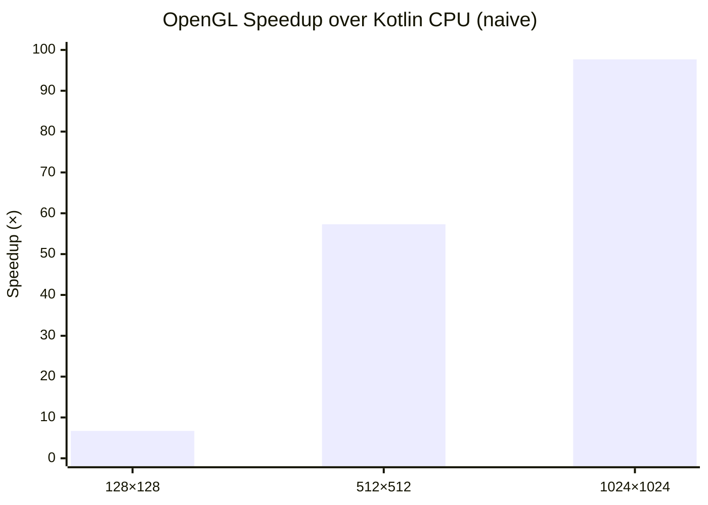

# Kompute: GPU Compute Shaders for Kotlin

Kompute is a Kotlin library designed to simplify the integration of GPU compute shaders into Kotlin applications. It
provides a high-level API for managing GPU resources, executing compute operations, and handling data transfers between
the CPU and GPU. With Kompute, developers can leverage the power of GPU acceleration for computationally intensive
tasks, such as machine learning inference, physics simulations, and data processing.

[](https://github.com/klaushauschild1984/kompute/actions/workflows/ci.yml)


## Requirements

- JDK 21+
- OpenGL 4.3+ capable GPU
- Linux or Windows

> **macOS:** OpenGL support on macOS is limited to 4.1 — compute shaders require 4.3 and are therefore not supported.
> macOS support depends on the upcoming Vulkan backend.

## Getting Started

Add the JitPack repository and the dependency to your build.

> **Note:** LWJGL native bindings are not included transitively — add the ones matching your target platform.

### Gradle (Kotlin DSL)

```kotlin
repositories {
    maven("https://jitpack.io")
}

dependencies {
    implementation("com.github.klaushauschild1984.kompute:kompute-opengl:v0.3.0")

    runtimeOnly("org.lwjgl:lwjgl:3.3.4:natives-linux")
    runtimeOnly("org.lwjgl:lwjgl-glfw:3.3.4:natives-linux")
    runtimeOnly("org.lwjgl:lwjgl-opengl:3.3.4:natives-linux")
}
```

### Maven

```xml
<repositories>
    <repository>
        <id>jitpack.io</id>
        <url>https://jitpack.io</url>
    </repository>
</repositories>

<dependencies>
    <dependency>
        <groupId>com.github.klaushauschild1984.kompute</groupId>
        <artifactId>kompute-opengl</artifactId>
        <version>v0.3.0</version>
    </dependency>
    <dependency>
        <groupId>org.lwjgl</groupId>
        <artifactId>lwjgl</artifactId>
        <version>3.3.4</version>
        <classifier>natives-linux</classifier>
        <scope>runtime</scope>
    </dependency>
    <dependency>
        <groupId>org.lwjgl</groupId>
        <artifactId>lwjgl-glfw</artifactId>
        <version>3.3.4</version>
        <classifier>natives-linux</classifier>
        <scope>runtime</scope>
    </dependency>
    <dependency>
        <groupId>org.lwjgl</groupId>
        <artifactId>lwjgl-opengl</artifactId>
        <version>3.3.4</version>
        <classifier>natives-linux</classifier>
        <scope>runtime</scope>
    </dependency>
</dependencies>
```

## Usage

Select a backend, attach a compute shader, configure storage buffers, dispatch, and read results.

### Kotlin

```kotlin
Kompute.openGL().use { openGL ->
    val output = ShaderData.StorageBuffer<FloatArray>(1).size(128).asOutput()
    val result = openGL
        .shader(ShaderSource.Code(glslCode))
        .data(
            ShaderData.StorageBuffer<FloatArray>(0).data(input),
            output,
        )
        .dispatch(x = 64)
        .execute()
    println(result[output].contentToString())
}
```

### Java

```java
try (Backend backend = Kompute.openGL()) {
    var output = ShaderData.StorageBuffer.newStorageBuffer(1, float[].class).size(128).asOutput();
    var result = backend
        .shader(new ShaderSource.Code(glslCode))
        .data(
            ShaderData.StorageBuffer.newStorageBuffer(0, float[].class).data(input),
            output
        )
        .dispatch(64)
        .execute();
    float[] data = result.get(output);
}
```

## Shader Sources

Shaders can be loaded from different sources:

```kotlin
// Inline GLSL
ShaderSource.Code("...")

// File on disk
ShaderSource.File(Path.of("shaders/multiply.glsl"))

// Classpath resource
ShaderSource.Stream(MyClass::class.java.getResourceAsStream("shader.glsl")!!)
```

## Storage Buffers

Storage buffers are the primary data exchange mechanism between CPU and GPU.

### Capabilities

`StorageBuffer<T>` is generic — the type parameter maps GLSL types to their Kotlin equivalents:

| GLSL                        | Kotlin        |
|-----------------------------|---------------|
| `float` / `vec*` / `mat*`  | `FloatArray`  |
| `int` / `ivec*` / `uint` / `uvec*` | `IntArray` |
| `double` / `dvec*`         | `DoubleArray` |
| Struct                      | `ByteArray`   |

### Usage

```kotlin
val input  = StorageBuffer<FloatArray>(0).data(floatArrayOf(1f, 2f, 3f))
val output = StorageBuffer<FloatArray>(1).size(128).asOutput()

// read-write: initialized with data, result readable afterwards
val inout  = StorageBuffer<FloatArray>(2).data(existing).asOutput()
```

Results are retrieved via the buffer object after execution:

```kotlin
val data: FloatArray = result[output]
```

## Uniform Buffer Objects *(planned — v0.4.0)*

UBOs pass read-only configuration data from CPU to shader — ideal for parameters like viewport
dimensions, zoom levels, or transformation matrices. Unlike storage buffers, UBOs cannot be written
by the shader.

```kotlin
// Not yet supported
UniformBuffer(0).data(floatArrayOf(centerX, centerY, zoom))
```

> **Note:** UBOs use std140 memory layout. `vec3` is aligned to 16 bytes, which requires manual
> padding in the data array. A typed builder to handle alignment automatically is under consideration.

## Scalar Uniforms *(planned — v0.5.0)*

Scalar uniforms pass individual values by name directly to the shader — no binding index required.

```kotlin
// Not yet supported
uniform("zoom", 1.5f)
uniform("maxIterations", 256)
```

## Atomic Counters *(planned — v0.5.0)*

Atomic counters allow threads to increment a shared counter safely across parallel invocations —
useful for algorithms like Monte-Carlo sampling where multiple threads accumulate a result.

```kotlin
// Not yet supported
AtomicCounter(0).asOutput()
```

## Image2D *(planned — v0.6.0)*

`image2D` allows compute shaders to write directly to a 2D texture — enabling GPU-side image
generation without transferring intermediate data back to the CPU.

```kotlin
// Not yet supported
Image2D(0, width = 1024, height = 1024).asOutput()
```

## Performance

Benchmarks are implemented using [JMH](https://github.com/openjdk/jmh) in the `kompute-benchmark` module.
Each benchmark compares a naive Kotlin CPU implementation against the OpenGL compute shader backend.
Backend initialization and shader compilation are excluded from the measurement — only buffer transfer,
dispatch, and readback are measured.

### Matrix multiplication

Matrix multiplication computes `C = A × B` for two square float matrices.
The OpenGL shader launches one thread per output element in a 2D workgroup grid
(`local_size_x = 8, local_size_y = 8`).

Two CPU baselines are compared:

- **Naive** — plain O(n³) triple loop, no parallelism
- **Optimized** — parallelized with Kotlin coroutines *(planned)*

> The naive baseline shows the raw GPU advantage out-of-the-box. The optimized baseline
> will show what CPU-side parallelism can recover — and where GPU processing still wins.

| Size of matrix | Kotlin naive (ms) | Kotlin optimized (ms) | OpenGL (ms) | GPU vs. naive | GPU vs. optimized |
|----------------|-------------------|-----------------------|-------------|---------------|-------------------|
| 128×128        | 1,404             | —                     | 0,208       | ~6,7×         | —                 |
| 512×512        | 124,424           | —                     | 2,172       | ~57×          | —                 |
| 1024×1024      | 2735,201          | —                     | 27,989      | ~97×          | —                 |



## Building

```bash
./gradlew build
```

Tests require a display server and OpenGL-capable GPU. On headless systems use:

```bash
xvfb-run ./gradlew build
```

## Showcases

*Coming soon: Mandelbrot set, Monte-Carlo sampling*

## Milestones

| Version                                                                       | Focus |
|-------------------------------------------------------------------------------|-------|
| [`v0.1.0`](https://github.com/klaushauschild1984/kompute/releases/tag/v0.1.0) | OpenGL Storage Buffer — initial release |
| [`v0.2.0`](https://github.com/klaushauschild1984/kompute/releases/tag/v0.2.0) | Stability (exception handling, binding validation) |
| [`v0.3.0`](https://github.com/klaushauschild1984/kompute/releases/tag/v0.3.0) | Typed storage buffers — `StorageBuffer<T>` for `FloatArray`, `IntArray`, `DoubleArray`, `ByteArray` |
| `v0.4.0`                                                                      | UBO support |
| `v0.5.0`                                                                      | Scalar uniform + atomic counter support |
| `v0.6.0`                                                                      | `image2D` support |
| `v0.7.0`                                                                      | Typed builder — `kompute-serialization` with `@GpuStruct` / `@GpuField` and automatic std140/std430 alignment |
| `v0.8.0`                                                                      | Windows support |
| `v0.9.0`                                                                      | Vulkan backend |
| `v1.0.0`                                                                      | Stable, complete API |

## Contributing

Contributions are welcome. Please open an issue first to discuss what you would like to change.
