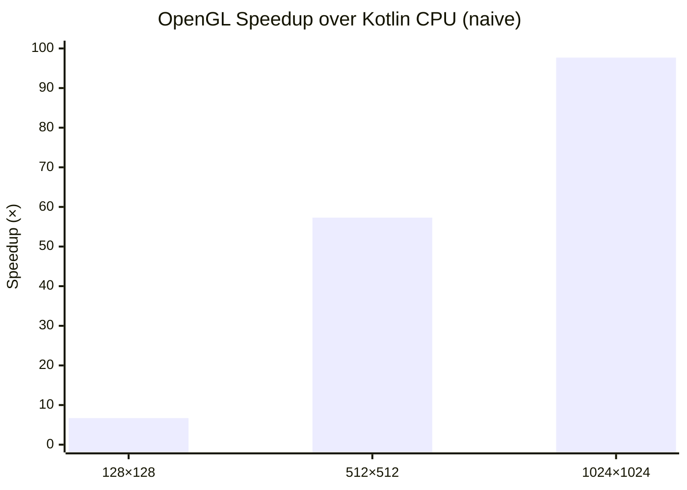

# Kompute: GPU Compute Shaders for Kotlin

Kompute is a Kotlin library designed to simplify the integration of GPU compute shaders into Kotlin applications. It
provides a high-level API for managing GPU resources, executing compute operations, and handling data transfers between
the CPU and GPU. With Kompute, developers can leverage the power of GPU acceleration for computationally intensive
tasks, such as machine learning inference, physics simulations, and data processing.

## CI Status

| Status |                                                                                                                                                                   |
|--------|-------------------------------------------------------------------------------------------------------------------------------------------------------------------|
| main   | [](https://github.com/klaushauschild1984/kompute/actions/workflows/ci.yml) |


| Coverage       |                                                      |
|----------------|------------------------------------------------------|
| Core           |      |
| OpenGL Backend |  |

| Repository  |                                                                                      |
|-------------|--------------------------------------------------------------------------------------|
| Last Commit |  |
| Open Issues |            |
| Repo Size   |      |

## Requirements

| Requirement | Version                                                                                  |
|-------------|------------------------------------------------------------------------------------------|
| JDK         |                                       |
| Kotlin      |  |
| OpenGL      |                                  |
| OS          |                    |

> **macOS:** OpenGL support on macOS is limited to 4.1 — compute shaders require 4.3 and are therefore not supported.
> macOS support depends on the upcoming Vulkan backend.

## Getting Started

| JitPack                                                                                                           | License                                                                         |
|-------------------------------------------------------------------------------------------------------------------|---------------------------------------------------------------------------------|
| [](https://jitpack.io/#klaushauschild1984/kompute) | [](LICENSE) |

Add the JitPack repository and the dependency to your build.

> **Note:** LWJGL native bindings are not included transitively — add the ones matching your target platform.

### Gradle (Kotlin DSL)

```kotlin
repositories {
    maven("https://jitpack.io")
}

dependencies {
    implementation("com.github.klaushauschild1984.kompute:kompute-opengl:v0.4.0")

    implementation(platform("org.lwjgl:lwjgl-bom:3.3.4"))
    runtimeOnly("org.lwjgl:lwjgl::natives-linux")
    runtimeOnly("org.lwjgl:lwjgl-glfw::natives-linux")
    runtimeOnly("org.lwjgl:lwjgl-opengl::natives-linux")
}
```

### Maven

```xml
<repositories>
    <repository>
        <id>jitpack.io</id>
        <url>https://jitpack.io</url>
    </repository>
</repositories>

<dependencyManagement>
    <dependencies>
        <dependency>
            <groupId>org.lwjgl</groupId>
            <artifactId>lwjgl-bom</artifactId>
            <version>3.3.4</version>
            <type>pom</type>
            <scope>import</scope>
        </dependency>
    </dependencies>
</dependencyManagement>

<dependencies>
    <dependency>
        <groupId>com.github.klaushauschild1984.kompute</groupId>
        <artifactId>kompute-opengl</artifactId>
        <version>v0.4.0</version>
    </dependency>
    <dependency>
        <groupId>org.lwjgl</groupId>
        <artifactId>lwjgl</artifactId>
        <classifier>natives-linux</classifier>
        <scope>runtime</scope>
    </dependency>
    <dependency>
        <groupId>org.lwjgl</groupId>
        <artifactId>lwjgl-glfw</artifactId>
        <classifier>natives-linux</classifier>
        <scope>runtime</scope>
    </dependency>
    <dependency>
        <groupId>org.lwjgl</groupId>
        <artifactId>lwjgl-opengl</artifactId>
        <classifier>natives-linux</classifier>
        <scope>runtime</scope>
    </dependency>
</dependencies>
```

## Usage

Select a backend, attach a compute shader, configure storage buffers, dispatch, and read results.

### Kotlin

```kotlin
Kompute.openGL().use { openGL ->
    val output = StorageBuffer<FloatArray>(1).size(128).asOutput()
    val result = openGL
        .shader(ShaderSource.Code(glslCode))
        .data(
            StorageBuffer<FloatArray>(0).data(input),
            output,
        )
        .dispatch(x = 64)
        .execute()
    println(result[output].contentToString())
}
```

### Java

```java
try (Backend backend = Kompute.openGL()) {
    var output = StorageBuffer.newStorageBuffer(1, float[].class).size(128).asOutput();
    var result = backend
        .shader(new ShaderSource.Code(glslCode))
        .data(
            StorageBuffer.newStorageBuffer(0, float[].class).data(input),
            output
        )
        .dispatch(64)
        .execute();
    float[] data = result.get(output);
}
```

## Shader Sources

Shaders can be loaded from different sources:

```kotlin
// Inline GLSL
ShaderSource.Code("...")

// File on disk
ShaderSource.File(Path.of("shaders/multiply.glsl"))

// Classpath resource
ShaderSource.Stream(MyClass::class.java.getResourceAsStream("shader.glsl")!!)
```

## Storage Buffer

Storage buffers are the primary data exchange mechanism between CPU and GPU. They can be used
as input, output, or read-write and are bound via `layout(std430, binding = N)` in the shader.

| Kotlin        | GLSL                               |
|---------------|------------------------------------|
| `FloatArray`  | `float` / `vec*` / `mat*`          |
| `IntArray`    | `int` / `ivec*` / `uint` / `uvec*` |
| `DoubleArray` | `double` / `dvec*`                 |
| `ByteArray`   | struct (manual layout)             |

```kotlin
val input  = StorageBuffer<FloatArray>(0).data(floatArrayOf(1f, 2f, 3f))  // input
val output = StorageBuffer<FloatArray>(1).size(128).asOutput()             // output
val inout  = StorageBuffer<FloatArray>(2).data(existing).asOutput()        // read-write
```

Results are retrieved via the buffer object after execution:

```kotlin
val data: FloatArray = result[output]
```

## Uniform Buffer Object

UBOs pass read-only configuration data from CPU to shader — ideal for parameters like viewport
dimensions, zoom levels, or transformation matrices. Unlike storage buffers, the shader cannot write UBOs.
They are bound via `layout(std140, binding = N)` in the shader.

| Kotlin      | GLSL                          |
|-------------|-------------------------------|
| `ByteArray` | struct (std140 memory layout) |

Shader:
```glsl
layout(std140, binding = 0) uniform Params {
   vec3  center;   // 12 bytes — but std140 pads vec3 to 16 bytes
   float zoom;     // starts at offset 16, not 12
};
```

Kotlin:
```kotlin
val data = ByteBuffer.allocate(Float.SIZE_BYTES * 4 + Float.SIZE_BYTES)
    .order(ByteOrder.nativeOrder())
    .putFloat(centerX)
    .putFloat(centerY)
    .putFloat(centerZ)
    .putFloat(0f)       // padding — vec3 occupies 16 bytes in std140
    .putFloat(zoom)
    .array()
UniformBufferObject(0).data(data)
```

> **Note:** UBOs use std140 memory layout. `vec3` is aligned to 16 bytes, which requires manual
> padding in the data array. A typed builder to handle alignment automatically is planned for v0.7.0.

## Scalar Uniform

Scalar uniforms pass individual typed values by name directly to the shader — no binding index required.
Unlike UBOs, they are declared as plain `uniform` variables in the shader source.

Shader:
```glsl
uniform float zoom;
uniform int maxIterations;
uniform bool highQuality;
```

Kotlin:
```kotlin
ScalarUniform<Float>("zoom").value(1.5f)
ScalarUniform<Int>("maxIterations").value(256)
ScalarUniform<Boolean>("highQuality").value(true)

// unsigned int in the shader
ScalarUniform<Int>("flags").value(0xFF).unsigned()
```

| Kotlin               | GLSL     |
|----------------------|----------|
| `Int`                | `int`    |
| `Int` + `unsigned()` | `uint`   |
| `Float`              | `float`  |
| `Double`             | `double` |
| `Boolean`            | `bool`   |

## Atomic Counter *(planned — v0.5.0)*

Atomic counters allow threads to increment a shared counter safely across parallel invocations —
useful for algorithms like Monte-Carlo sampling where multiple threads accumulate a result.

```kotlin
// Not yet supported
AtomicCounter(0).asOutput()
```

## Image2D *(planned — v0.6.0)*

`image2D` allows compute shaders to write directly to a 2D texture — enabling GPU-side image
generation without transferring intermediate data back to the CPU.

```kotlin
// Not yet supported
Image2D(0, width = 1024, height = 1024).asOutput()
```

## Performance

Benchmarks are implemented using [JMH](https://github.com/openjdk/jmh) in the `kompute-benchmark` module.
Each benchmark compares a naive Kotlin CPU implementation against the OpenGL compute shader backend.
Backend initialization and shader compilation are excluded from the measurement — only buffer transfer,
dispatch, and readback are measured.

### Matrix multiplication

Matrix multiplication computes `C = A × B` for two square float matrices.
The OpenGL shader launches one thread per output element in a 2D workgroup grid
(`local_size_x = 8, local_size_y = 8`).

Two CPU baselines are compared:

- **Naive** — plain O(n³) triple loop, no parallelism
- **Optimized** — parallelized with Kotlin coroutines *(planned)*

> The naive baseline shows the raw GPU advantage out-of-the-box. The optimized baseline
> will show what CPU-side parallelism can recover — and where GPU processing still wins.

| Size of matrix | Kotlin naive (ms) | Kotlin optimized (ms) | OpenGL (ms) | GPU vs. naive | GPU vs. optimized |
|----------------|-------------------|-----------------------|-------------|---------------|-------------------|
| 128×128        | 1,404             | —                     | 0,208       | ~6,7×         | —                 |
| 512×512        | 124,424           | —                     | 2,172       | ~57×          | —                 |
| 1024×1024      | 2735,201          | —                     | 27,989      | ~97×          | —                 |



## Building

```bash
./gradlew build
```

Tests require a display server and OpenGL-capable GPU. On headless systems use:

```bash
xvfb-run ./gradlew build
```

## Showcases

*Coming soon: Mandelbrot set, Monte-Carlo sampling*

## Milestones

| Version                                                                       | Focus                                                                                                         |
|-------------------------------------------------------------------------------|---------------------------------------------------------------------------------------------------------------|
| [`v0.1.0`](https://github.com/klaushauschild1984/kompute/releases/tag/v0.1.0) | OpenGL Storage Buffer — initial release                                                                       |
| [`v0.2.0`](https://github.com/klaushauschild1984/kompute/releases/tag/v0.2.0) | Stability (exception handling, binding validation)                                                            |
| [`v0.3.0`](https://github.com/klaushauschild1984/kompute/releases/tag/v0.3.0) | Typed storage buffers — `StorageBuffer<T>` for `FloatArray`, `IntArray`, `DoubleArray`, `ByteArray`           |
| [`v0.4.0`](https://github.com/klaushauschild1984/kompute/releases/tag/v0.4.0) | UBO support                                                                                                   |
| `v0.5.0`                                                                      | Scalar uniform + atomic counter support                                                                       |
| `v0.6.0`                                                                      | `image2D` support                                                                                             |
| `v0.7.0`                                                                      | Typed builder — `kompute-serialization` with `@GpuStruct` / `@GpuField` and automatic std140/std430 alignment |
| `v0.8.0`                                                                      | Windows support                                                                                               |
| `v0.9.0`                                                                      | Vulkan backend                                                                                                |
| `v1.0.0`                                                                      | Stable, complete API                                                                                          |

## Contributing

Contributions are welcome. Please open an issue first to discuss what you would like to change.
