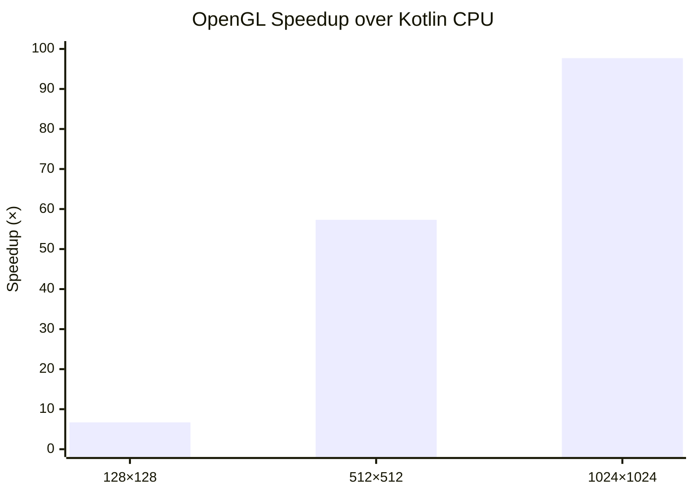

# Kompute: GPU Compute Shaders for Kotlin

Kompute is a Kotlin library designed to simplify the integration of GPU compute shaders into Kotlin applications. It
provides a high-level API for managing GPU resources, executing compute operations, and handling data transfers between
the CPU and GPU. With Kompute, developers can leverage the power of GPU acceleration for computationally intensive
tasks, such as machine learning inference, physics simulations, and data processing.

## Usage

Buffer names in Kotlin must match the binding names declared in the GLSL shader source.

```kotlin
Kompute.openGL().use { backend ->
    val result = backend.shader(ShaderSource.File(Path.of("shaders/multiply.glsl")))
        .input(0).buffer(floatArrayOf(1f, 2f, 3f, 4f))
        .input(1).buffer(floatArrayOf(2f))
        .output(2, "result").buffer(FloatArray(4))
        .dispatch(4)
        .execute()
        .output("result")
}
```

## Benchmarks

### Matrix multiplication

| Size of matrix | Kotlin (ms) | OpenGL (ms) | Speedup |
|----------------|-------------|-------------|---------|
| 128×128        | 1,404       | 0,208       | ~6,7×   |
| 512×512        | 124,424     | 2,172       | ~57×    |
| 1024×1024      | 2735,201    | 27,989      | ~97×    |



## TODOs

A collection of topics I want to address in the future enhancing the library.

* [ ] API
  * [ ] specific exception handling
  * [ ] binding validation (collisions, shader inspection)
  * [ ] generalize buffer setup (SSBO ↔ UBO, just size scalar uniform)
* [ ] OpenGL
  * [ ] optimization
    * [ ] shader caching
    * [ ] pre-compilation
    * [ ] multi-dispatch
* [ ] Vulkan
  * [ ] general implementation
* [ ] Benchmarking
  * [ ] Mandelbrot-Set (plus visualization)
  * [ ] Monte-Carlo Pi calculation
